Hi, I'm a 🎓 PhD candidate in the 🚀 [Department of Aerospace Engineering](https://ae.kaist.ac.kr/) at the [Korea Advanced Institute of Science and Technology](https://kaist.ac.kr/).
I am doing research in the 🔬 [Laboratory for information and Control Systems](https://lics.kaist.ac.kr/) under the supervision of [Prof. Han-Lim Choi](https://lics.kaist.ac.kr/people/han-lim-choi/).

---

## Publications

### Journal Papers

- **TCTC: Enhancing Time-Series Clustering through Temporal Contrastive Learning** _(In progress)_. **JJ Damanik**, T Phisannupawong, HL Choi.

- [Consensus-based clustering and data aggregation in decentralized network of multi-agent systems](https://peerj.com/articles/cs-1445/?td=tw). **JJ Damanik**, MC Lim, HM Jeong, Ho-Yeon Kim, HL Choi. PeerJ Computer Science. 2023.

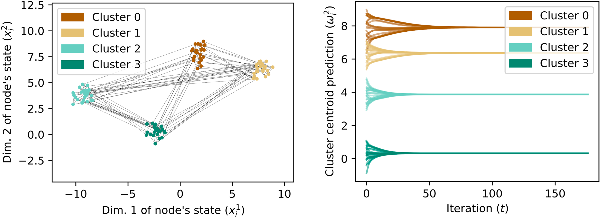

- [Polygon formation of multiple nonholonomic mobile robots with double-level-control collision avoidance scheme](https://www.tandfonline.com/doi/abs/10.1080/23307706.2022.2064341). A Widyotriatmo, E Joelianto, AM Burohman, **JJ Damanik**, YY Nazaruddin. Journal of Control and Decision. 2022._Contributed to Experimental design, data collection, and analysis._

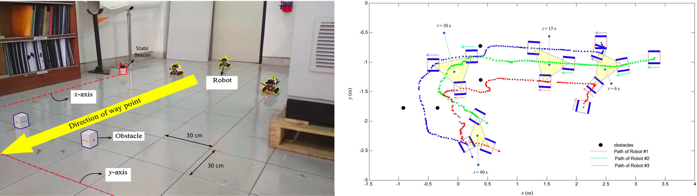

### Conference Papers

- **Contrastive Learning-Based Air Traffic Trajectory Representation: A Case Study on Incheon International Airport** _(Accepted)_. T Phisannupawong, **JJ Damanik**, HL Choi. The CEAS Conference on Guidance, Navigation and Control. 2024.

- [Comparative Analysis of Autoencoder Architectures on Incheon Airport Flights Trajectory Reconstruction](https://www.dbpia.co.kr/journal/articleDetail?nodeId=NODE11657915). **JJ Damanik**, T Phisannupawong, HL Choi. The Korean Society for Aeronautical and Space Sciences Fall Conference. 2023.

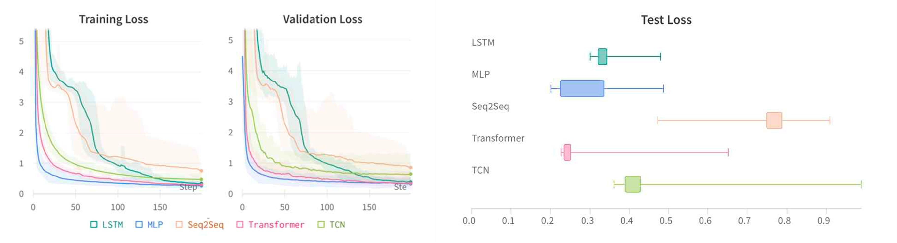

- [Sampling-Based Path Planning Algorithm Considering Moving Obstacles Based on RRT](https://link.springer.com/chapter/10.1007/978-3-031-26889-2_5). **JJ Damanik**, HL Choi. International Conference on Robot Intelligence Technology and Applications. 2022.

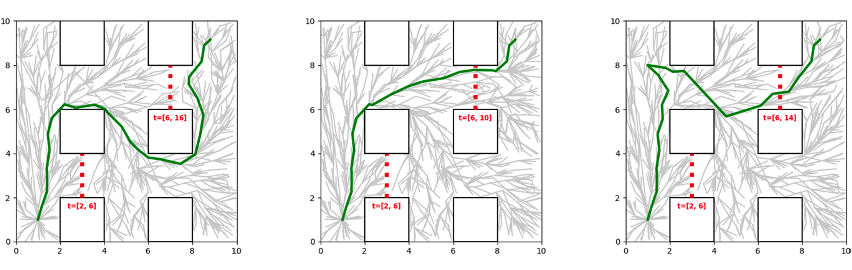

- [Spatial Trajectory Clustering of Incheon Airport Flights](https://www.dbpia.co.kr/Journal/articleDetail?nodeId=NODE11180587). **JJ Damanik**, CK Shin, HL Choi. The Korean Society for Aeronautical and Space Sciences Fall Conference. 2022.

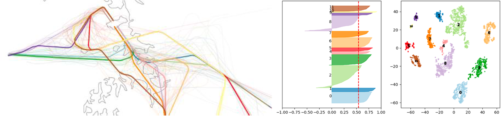

- [Solving Delivery Assignment in Hybrid-Transit Network Using Multi-agent Reinforcement Learning](https://link.springer.com/chapter/10.1007/978-3-030-97672-9_44). **JJ Damanik**, H Kasan, HL Choi. International Conference on Robot Intelligence Technology and Applications. 2021.

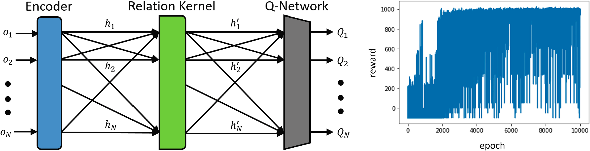

- [Vehicle Routing Problem with Pickup, Relay, and Delivery: Delivery Task Assignment in Hybrid-Transit Logistics Network](https://arc.aiaa.org/doi/abs/10.2514/6.2021-2341). **JJ Damanik**, HL Choi. AIAA Aviation 2021 Forum. 2021.

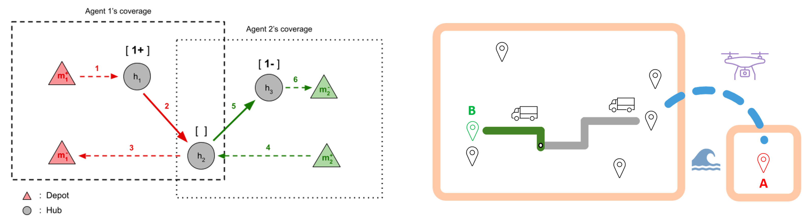

- [Decentralized delivery task allocation for hybrid-transit logistics network system](https://www.dbpia.co.kr/journal/articleDetail?nodeId=NODE10526241). **JJ Damanik**, CK Shin, HL Choi. The Korean Society for Aeronautical and Space Sciences Fall Conference. 2020.

- [Flocking of Robots with Predictive Localization](https://ieeexplore.ieee.org/abstract/document/8674680). **JJ Damanik**, DR Andriani, A Widyotriatmo, E Joelianto. IEEE International Conference on Robotics, Biomimetics, and Intelligent Computational Systems (Robionetics). 2018.

### Theses

- [Collaborative pickup and delivery system with UAV](https://koasas.kaist.ac.kr/handle/10203/296271) _(MS Thesis)_. **JJ Damanik**. KAIST Library. 2021.

## Projects

### Web development

| Air Traffic Flow Visualization                                                                                                                                                                                                                                 |
|----------------------------------------------------------------------------------------------------------------------------------------------------------------------------------------------------------------------------------------------------------------|
| 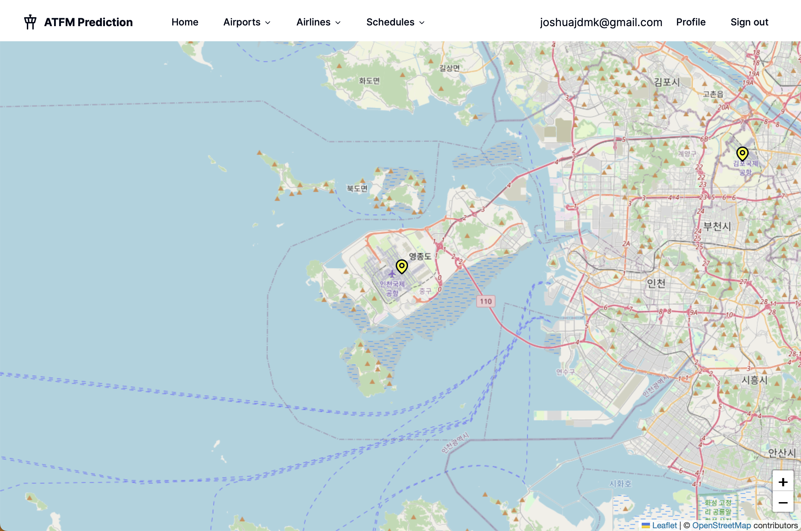                                                                                                                                                                                                       |
| A platform to acquire the ADSB data from open source database ([OpenSky](https://opensky-network.org)), analyze the traffic flows, and predict the airborne delay. It also visualize of realtime flight trajectories in a map. Made using React in Javascript. |

| [Daewoong Sharedoc Info](https://sharedocinfo.com)                                                                                                                                                                                      |
|-----------------------------------------------------------------------------------------------------------------------------------------------------------------------------------------------------------------------------------------|
|                                                                                                                                                                                         |
| A platform to accelerate coordination between Daewoong Pharmaceutical Company and Doctors around the world in generating contents regarding health and medicines. Made using React in Javascript. Deployed in AWS (Amazon Web Service). |

### Software Development

| [AngklungFM](https://github.com/damanikjosh/AngklungFM)                                                                                                                                                           |
|-------------------------------------------------------------------------------------------------------------------------------------------------------------------------------------------------------------------|
| 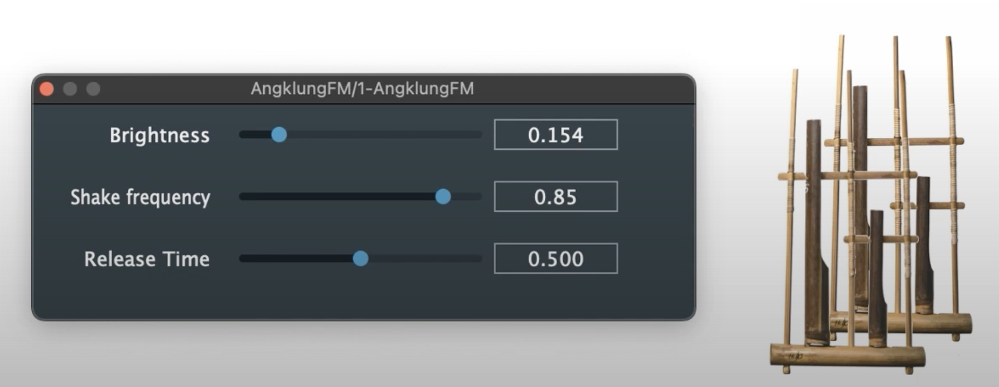                                                                                                                                                              |
| AngklungFM is a VST3 plugin that synthesizes the sound of the angklung, a traditional Indonesian musical instrument. Made with JUCE framework in C++. [Video](https://www.youtube.com/watch?v=tIuynlJ_XaU&t=341s) |

| [VirtualGL ROS Docker Image](https://github.com/damanikjosh/virtualgl-turbovnc-ros2-docker/tree/main)                                |
|--------------------------------------------------------------------------------------------------------------------------------------|
| 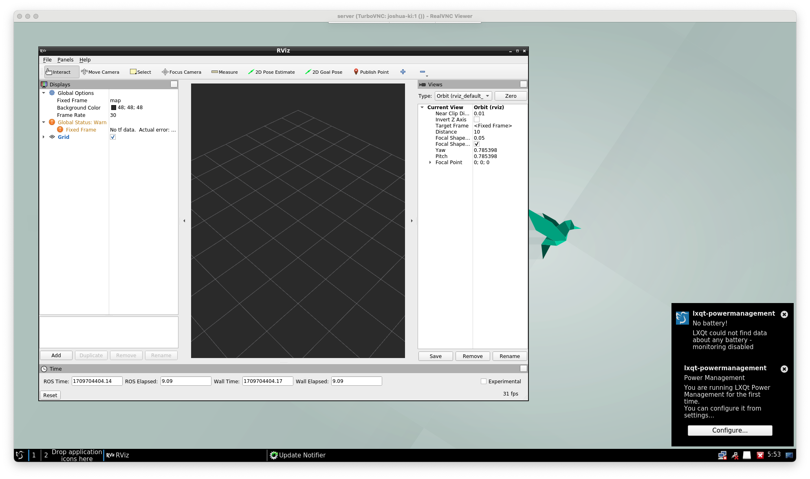                                                                                 |
| A Docker image that allows running ROS applications with graphical interface remotely. It integrates VirtualGL, TurboVNC, and noVNC. |

| Motion Analysis MOCAP integration to [libmotioncapture](https://github.com/damanikjosh/libmotioncapture)                                       |
|------------------------------------------------------------------------------------------------------------------------------------------------|
| Contributed to the integration of the motion capture system used by my laboratory to the open-source library libmotioncapture. Made using C++. |

### Robotics Simulations

| [Gazebo Simulation of Illegal Fishing Patrol](https://www.youtube.com/watch?v=kgIcTipmNLQ)                                                                                                 |
|--------------------------------------------------------------------------------------------------------------------------------------------------------------------------------------------|
| 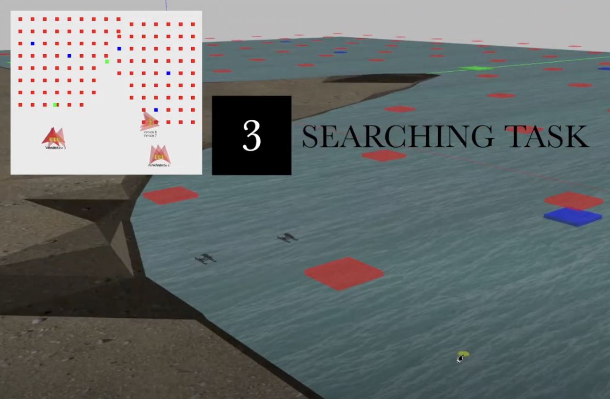                                                                                                                                         |
| A simulation of a quadrotor drone patrolling the sea to detect illegal fishing activities. Made using ROS, Gazebo, and PX4 Autopilot. [Video](https://www.youtube.com/watch?v=kgIcTipmNLQ) |

